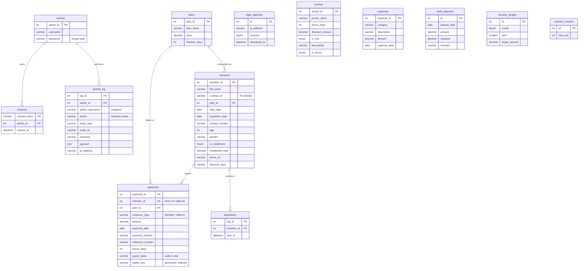

# Fitness Synergy — Entity Relationship Diagram

> Reconstructed from the live backend (`add_member.php`, `add_walkin.php`, `add_plan.php`,
> `add_promo.php`, `add_expense.php`, `time_in.php`, `audit.php`, `database_patch.sql`).
> PK = Primary Key, FK = Foreign Key.

## Mermaid ERD (renders on GitHub / VS Code Mermaid preview)



## Plain-text version (if Mermaid won't render on the projector)

```
                 +-----------+
                 |  admins   |
                 +-----------+
                  | 1     | 1
        owns      |       |   performs
       (1..*)     |       |   (1..*)
        +---------+       +-----------+
        v                             v
   +----------+                 +--------------+
   | sessions |                 | activity_log |
   +----------+                 +--------------+

   +----------+    1      *   +-----------+   *      1   +---------+
   |  plans   |---------------|  members  |-------------|  plans  |  (same plans table)
   +----------+ subscribed by +-----------+  billed on  +---------+
        |                       | 1     | 1
        | billed on (1..*)      |       | checks in (1..*)
        v                       v       v
   +----------+           +----------+  +------------+
   | payments |<----------| payments |  | attendance |
   +----------+  member   +----------+  +------------+
   (member_id may be NULL = a Walk-in payment)

   Standalone (no FK, operational/reference): expenses, bank_deposits,
   monthly_targets, promos, login_attempts, contract_counter, settings
```

## Relationships in one sentence each (say these out loud in the defense)
- **One plan → many members** (a plan is subscribed to by many members; a member has exactly one current plan).
- **One member → many payments** (registration, every renewal, every installment is a payment row).
- **One member → many attendance rows** (one per gym visit).
- **A walk-in is a payment with `member_id = NULL`** and `customer_type = 'Walk-in'` — no member record needed.
- **One admin → many sessions / many audit-log entries.**

## Foreign keys & delete behavior (from `database_patch.sql`)
| Child | Parent | ON DELETE | Why |
|-------|--------|-----------|-----|
| `sessions.admin_id` | `admins` | CASCADE | delete an admin → kill their sessions |
| `attendance.member_id` | `members` | CASCADE | delete a member → their visit history goes too |
| `payments.member_id` | `members` | CASCADE | delete a member → their payments go too (walk-ins unaffected, member_id NULL) |
| `members.plan_id` | `plans` | RESTRICT | you **cannot delete a plan** that still has members on it |
